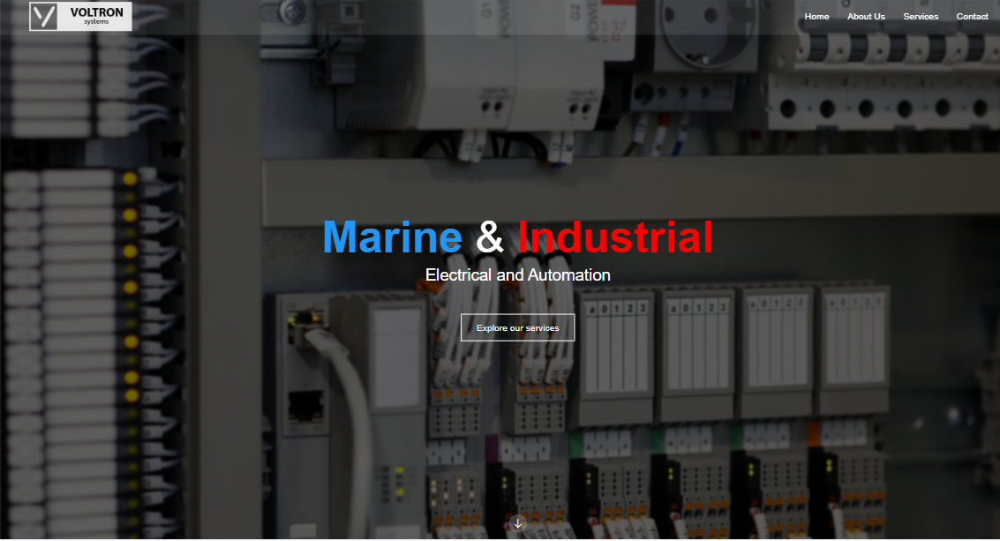

# Voltron - Industrial and marine electrical and automation website

### Description:

This website is developed with React for a seamless user experience and styled with Tailwind CSS to ensure a modern and visually appealing interface.

### Gh-pages:

### Key Features:

- Dynamic UI: Powered by React, our website offers a dynamic and interactive user interface, providing a smooth navigation experience.

- Responsive Design: Tailwind CSS ensures a responsive design, making the website accessible and visually appealing on various devices and screen sizes.

### Technologies Used:

- React
- Tailwind CSS

### How to Run the Project:

1. Clone the repository from GitHub.
1. Navigate to the project directory.
1. Run npm install to install dependencies.
1. Execute npm start to launch the application locally.
1. Open your browser and visit the specified address to experience Voltron.

### App screenshot:

